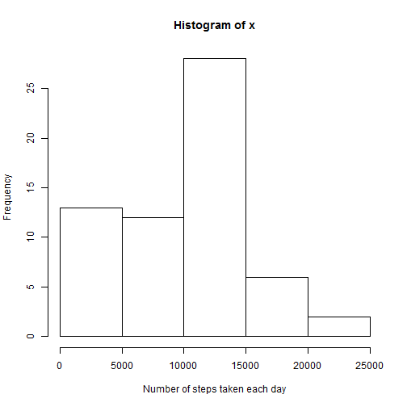
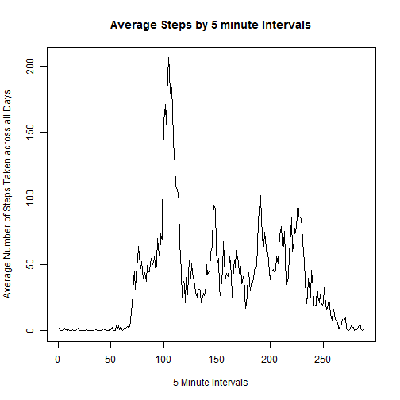
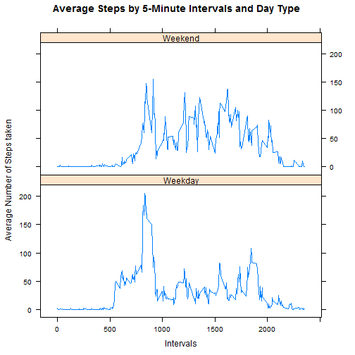

Reproducible Research Peer Assessment 1
=======================================

## Data
The data for this assignment can be downloaded from:
- [Activity Monitoring Data](https://d396qusza40orc.cloudfront.net/repdata%2Fdata%2Factivity.zip)  
  
The variables included in this dataset are:  
- steps: Number of steps taking in a 5-minute interval (missing values are coded as NA)  
- date: The date on which the measurement was taken in YYYY-MM-DD format  
- interval: Identifier for the 5-minute interval in which measurement was taken

## Loading and Pre-processing the data

```r
activity <- read.csv("activity.csv")
str(activity)
```

```
## 'data.frame':	17568 obs. of  3 variables:
##  $ steps   : int  NA NA NA NA NA NA NA NA NA NA ...
##  $ date    : Factor w/ 61 levels "2012-10-01","2012-10-02",..: 1 1 1 1 1 1 1 1 1 1 ...
##  $ interval: int  0 5 10 15 20 25 30 35 40 45 ...
```

```r
summary(activity)
```

```
##      steps                date          interval     
##  Min.   :  0.00   2012-10-01:  288   Min.   :   0.0  
##  1st Qu.:  0.00   2012-10-02:  288   1st Qu.: 588.8  
##  Median :  0.00   2012-10-03:  288   Median :1177.5  
##  Mean   : 37.38   2012-10-04:  288   Mean   :1177.5  
##  3rd Qu.: 12.00   2012-10-05:  288   3rd Qu.:1766.2  
##  Max.   :806.00   2012-10-06:  288   Max.   :2355.0  
##  NA's   :2304     (Other)   :15840
```

```r
activity$date <- as.Date(activity$date)
```

## What is mean total number of steps taken per day?

### Calculating the total number of steps taken each day

```r
TotalStepsByDay <- aggregate(activity$steps, by=list(activity$date), FUN=sum, na.rm=TRUE)
head(TotalStepsByDay)
```

```
##      Group.1     x
## 1 2012-10-01     0
## 2 2012-10-02   126
## 3 2012-10-03 11352
## 4 2012-10-04 12116
## 5 2012-10-05 13294
## 6 2012-10-06 15420
```

### Histogram of total number of steps taken each day

```r
with(TotalStepsByDay, hist(x, xlab="Number of steps taken each day"))
```

 

### Calculating mean and median of the total number of steps taken per day

```r
mean_steps <- mean(TotalStepsByDay$x)
median_steps <- median(TotalStepsByDay$x)
```
The __mean of number of steps__ taken each day is 9354.2295082. The __median of number of steps__ taken each day is 10395. 

## What is the average daily activity pattern?

### Calculating the average number of steps taken each day

```r
AvgStepsByInterval <- aggregate(activity$steps, by=list(activity$interval), FUN=mean, na.rm=TRUE)
head(AvgStepsByInterval)
```

```
##   Group.1         x
## 1       0 1.7169811
## 2       5 0.3396226
## 3      10 0.1320755
## 4      15 0.1509434
## 5      20 0.0754717
## 6      25 2.0943396
```

### Time series plot of 5 minute intervals and average number of steps taken each day

```r
with(AvgStepsByInterval, plot(x, type="l", xlab="5 Minute Intervals", ylab="Average Number of Steps Taken across all Days", main="Average Steps by 5 minute Intervals"))
```

 

### Which 5-minute interval contains the maximum number of steps?

```r
AvgStepsByInterval[AvgStepsByInterval$x==max(AvgStepsByInterval$x),]
```

```
##     Group.1        x
## 104     835 206.1698
```

```r
which(AvgStepsByInterval$x==max(AvgStepsByInterval$x))
```

```
## [1] 104
```

## Imputing missing values

### Calculate and report the total number of missing values in the dataset

```r
nrow(activity[is.na(activity$steps)==TRUE,])
```

```
## [1] 2304
```

### Filling up the missing values with median of the 5 minute time interval across days

```r
Median_StepsByInterval <- aggregate(activity$steps, by=list(activity$interval), FUN=median, na.rm=TRUE)

activity_new <- activity

for (i in seq(0,max(activity$interval), by=5)){
    activity_new$steps[is.na(activity_new$steps)==TRUE & activity_new$interval==i] <- Median_StepsByInterval$x[Median_StepsByInterval$Group.1==i]
  }

head(activity_new)
```

```
##   steps       date interval
## 1     0 2012-10-01        0
## 2     0 2012-10-01        5
## 3     0 2012-10-01       10
## 4     0 2012-10-01       15
## 5     0 2012-10-01       20
## 6     0 2012-10-01       25
```

### Calculating again the total number of steps taken each day and plotting a histogram

```r
TotalStepsByDay_new <- aggregate(activity_new$steps, by=list(activity_new$date), FUN=sum, na.rm=TRUE)
with(TotalStepsByDay_new, hist(x, xlab="Number of steps taken each day"))
```

 

### Calculating mean and median of the total number of steps taken per day

```r
mean_steps_new <- mean(TotalStepsByDay1$x)
median_steps_new <- median(TotalStepsByDay1$x)
```
The __mean of number of steps__ taken each day is 9503.8688525. The __median of number of steps__ taken each day is 10395. 

After imputing the missing values, there is an 1.6% increase in __mean__ value while the __median__ value remains the same. The reason for no change in the __median__ value is because the imputation done was also based on the __median__ values of the 5 minute time intervals across days.

## Are there differences in activity patterns between weekdays and weekends?

### Creating a new factor variable indicating the type of day

```r
for (i in 1:nrow(activity_new)){
  if(weekdays(activity_new$date[i])=="Monday"){
    activity_new$DayType[i] <- "Weekday"  
  }
  if(weekdays(activity_new$date[i])=="Tuesday"){
    activity_new$DayType[i] <- "Weekday"  
  }
  if(weekdays(activity_new$date[i])=="Wednesday"){
    activity_new$DayType[i] <- "Weekday"  
  }
  if(weekdays(activity_new$date[i])=="Thursday"){
    activity_new$DayType[i] <- "Weekday"  
  }
  if(weekdays(activity_new$date[i])=="Friday"){
    activity_new$DayType[i] <- "Weekday"  
  }
  if(weekdays(activity_new$date[i])=="Saturday"){
    activity_new$DayType[i] <- "Weekend"
  }
  if(weekdays(activity_new$date[i])=="Sunday"){
    activity_new$DayType[i] <- "Weekend"
  }
}

activity_new$DayType <- as.factor(activity_new$DayType)
head(activity_new)
```

```
##   steps       date interval DayType
## 1     0 2012-10-01        0 Weekday
## 2     0 2012-10-01        5 Weekday
## 3     0 2012-10-01       10 Weekday
## 4     0 2012-10-01       15 Weekday
## 5     0 2012-10-01       20 Weekday
## 6     0 2012-10-01       25 Weekday
```

### Calculating the average number of steps taken by type of day

```r
AvgStepsByDayType <- aggregate(activity_new$steps, by=list(activity_new$interval,activity_new$DayType), FUN=mean, na.rm=TRUE)

head(AvgStepsByDayType)
```

```
##   Group.1 Group.2          x
## 1       0 Weekday 2.02222222
## 2       5 Weekday 0.40000000
## 3      10 Weekday 0.15555556
## 4      15 Weekday 0.17777778
## 5      20 Weekday 0.08888889
## 6      25 Weekday 1.31111111
```

### Panel plot containing time series plots of 5-minute interval by day type

```r
library(lattice)
with(AvgStepsByDayType ,xyplot(x~Group.1|Group.2,xlab="Intervals", type="l", ylab="Average Number of Steps taken", main="Average Steps by 5-Minute Intervals and Day Type", layout=c(1,2)))
```

 

In case of weekdays, the peak of activity is concentrated just before 1000th minute while during weekends, the graph is spread out indicating an almost similar level of activity throughout the day.
